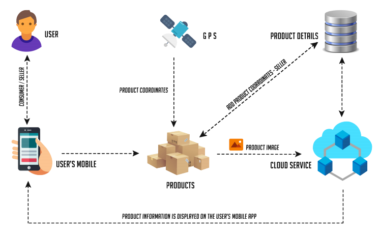
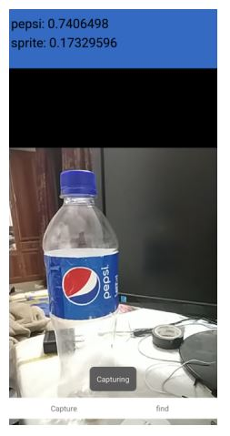

# Introduction
Shopping is always a trend,it is anever-ending activity. Most of the times customer fail to understand the actual quality and better alternatives. Considering the future, most of the consumer shops will be automated just like Amazon Go. So human interactions will be minimal and there would be no option for the customers to inquire about the products. This creates a need for a solution to solve the above scenario.

The solution that we are proposing here is an Android Application that acts as an Information Centre for the customers. The input to this system is an image scanned with the android application and the current coordinates of the user while scanning the product using the Android Application.  As output, the customer will be able to view information of the scanned product such as user reviews, original cost, tax, the status of the product, alternatives and location of the same product nearby. If the product is a food item then corresponding ingredients will be provided in the description.

Such a System will ensure that the customers are aware of the product they wish to buy. Genuine reviews from thousands of other customers will confirm the quality and usability of the product.

# Objectives of the Work
The main objective is to bring transparency in shopping field by allowing the customers to know about the alternatives and their effectiveness. The future shopping will be on Smart shops like Amazon go, where the human interactions are far less. So if there is an unfamiliar product normal customers won’t choose them over the usual ones. Our Application aims to fill this gap in communication between customers and producers.Our Application also provides information about the near shops with the lowest selling price.

# System Architecture

# Result
The screenshot of the developed mobile application is given below. The application successfully classifies the products with efficient accuracy and speed

# Conclusion
The developed system reads the image of the product through the mobile app and the user can use this system without any prior experience as the user interface is user friendly. This application makes it easier for the customer to select quality products without any knowledge of that product or manufacturer. With the nearby location feature, the customer caneasily find the available locations of the product. The App also provides product reviews from 1000s of customers.
